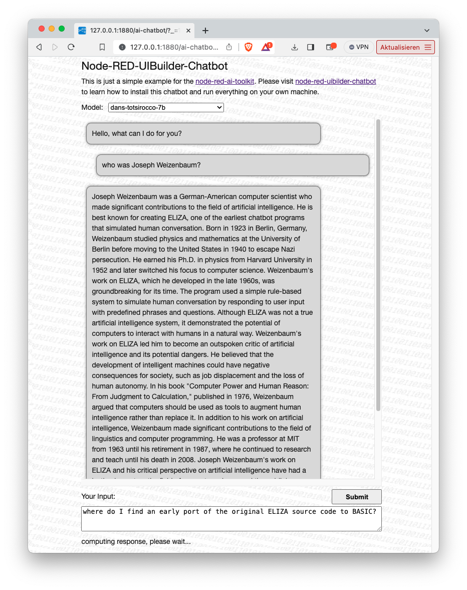
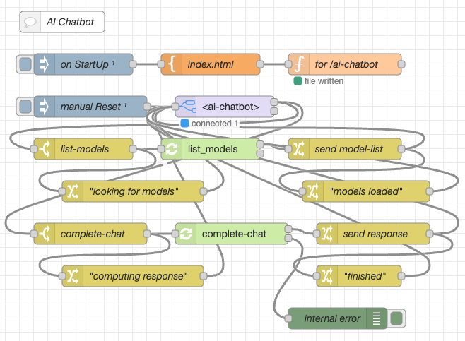

# node-red-ai-chatbot #

a simple AI Chatbot based on the Node-RED-AI-Toolkit

This repository contains a [Node-RED](https://nodered.org/) flow which implements a simple chatbot for AI models. It is primarily intended to serve as an example for the [Node-RED AI Toolkit](https://github.com/rozek/node-red-ai-toolkit), but may also be used on its own.

> **Important**: the AI toolkit and its examples are currently being developed very actively. Come back from time to time and watch out for additional models and nodes. 

> Just a small note: if you like this module and plan to use it, consider "starring" this repository (you will find the "Star" button on the top right of this page), so that I know which of my repositories to take most care of.

## Installation ##

This example requires a running Node-RED instance with installed [Node-RED AI Toolkit](https://github.com/rozek/node-red-ai-toolkit). If not already done, please follow the [installation instructions for the toolkit](https://github.com/rozek/node-red-ai-toolkit#installation) before continuing.

Then, follow the [instructions found in the UIBuilder Docs](https://totallyinformation.github.io/node-red-contrib-uibuilder/#/walkthrough1?id=how-to-get-started-4-steps-to-a-data-driven-web-app) to install the UIBuilder nodes.

Now, it's time to import the contents of file [AI-Chatbot-Flow.json](https://raw.githubusercontent.com/rozek/node-red-ai-chatbot/master/AI-Chatbot-Flow.json) - preferably into a new Node-RD workflow.

If necessary, you may also download a supported AI model (in GGUF format) into the toolkit's model folder.

## Usage ##

UIBuilder and the AI Chatbot flow will create and manage all files needed for the web frontend. Just navigate your browser to [http://127.0.0.1:1880/ai-web-search](http://127.0.0.1:1880/ai-chatbot) where `1880` is the port number configured for Node-RED and its flow editor.

The web page should immediately receive a list with all installed AI models - just choose one and you are set.

Now, enter a message in the "Input" area and press "Submit" - the chatbot will then generate a proper response. Enter your reply and see how the chatbot reacts.

## License ##

[MIT License](LICENSE.md)
